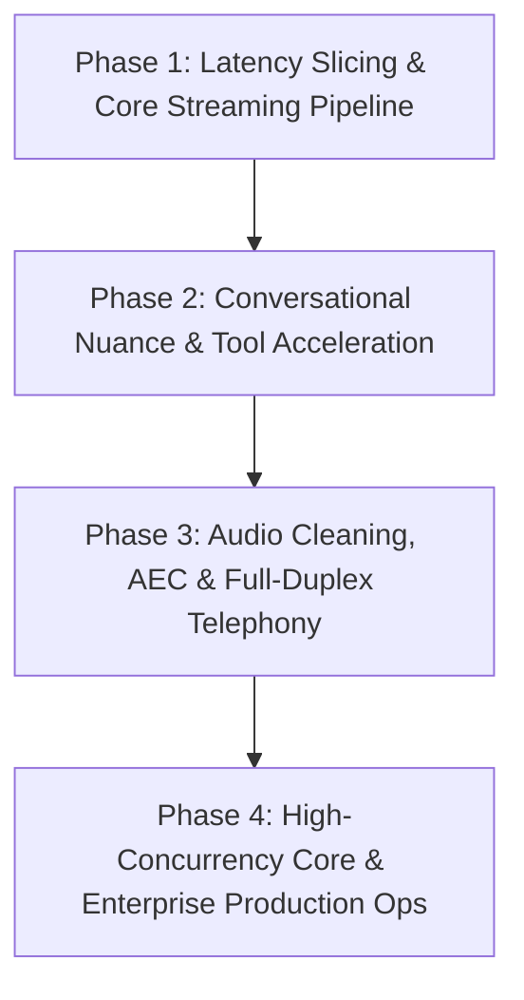

# 🎙️ Conversational AI Voice Platform: Master Architecture & Optimization Blueprint

> **Target Latency:** Sub-500ms End-to-End Voice-to-Voice (Targeting Elite Tier: 380ms–500ms)  
> **Architecture Style:** Cascaded Full-Duplex Streaming Pipeline (STT ➔ Orchestration/LLM ➔ TTS ➔ Telephony)  
> **Target Branch:** `feat/voice-agent-optimization-blueprint` (Synced with `main`)  
> **Status:** Active Master Architecture & Implementation Plan

---

## 📑 Table of Contents
1. [The Latency Budget & Component Breakdown](#1-the-latency-budget--component-breakdown)
2. [The "Big Three" Streaming Rules](#2-the-big-three-streaming-rules)
3. [Latency Optimization Hacks & Quick Wins](#3-latency-optimization-hacks--quick-wins)
4. [Fastest Model & Infrastructure Tier](#4-fastest-model--infrastructure-tier)
5. [Conversational Nuance & Real-Time Intelligence](#5-conversational-nuance--real-time-intelligence)
6. [Audio Pipeline, Telephony & Edge Engineering](#6-audio-pipeline-telephony--edge-engineering)
7. [Enterprise Scalability, Reliability & Production Ops](#7-enterprise-scalability-reliability--production-ops)
8. [Comprehensive 4-Phase Implementation Roadmap](#8-comprehensive-4-phase-implementation-roadmap)

---

## 1. The Latency Budget & Component Breakdown

A 1-second (1,000ms) latency is the classic "developer wall" in custom voice bots. Even if an LLM responds in 100ms, the end-to-end voice-to-voice latency accumulates across multiple pipeline stages.

```
Caller Speech ➔ [Telephony In] ➔ [VAD / Noise Filter] ➔ [STT WebSocket]
                       ➔ [Streaming Orchestrator / LLM] ➔ [Streaming TTS]
                       ➔ [Telephony Out (20ms frames)] ➔ Caller Ear
```

### ⏱️ Latency Budget Comparison Table

| Pipeline Component | Standard Latency (Good) | Elite Latency (Optimized) | Optimization Strategy |
| :--- | :--- | :--- | :--- |
| **Telephony Ingest (SIP/VoIP / WebRTC)** | 50ms – 100ms | **20ms – 40ms** | Route calls using RTP over UDP directly to servers close to the user via Anycast edge nodes. |
| **Voice Activity Detection (VAD)** | 400ms – 500ms | **200ms – 250ms** | Use Silero VAD or Deepgram VAD; set aggressive silence thresholds (200–250ms). |
| **Speech-to-Text (STT)** | 150ms – 250ms | **50ms – 100ms** | Live streaming WebSockets with Deepgram Nova-3 or Gladia. |
| **LLM Inference (Time to First Token - TTFT)** | 200ms – 350ms | **30ms – 80ms** | Ultra-fast LPU inference (Llama 3.2 on Groq / Cerebras), PhoneLLM, or GPT-4.1/4o Mini. Avoid reasoning chains. |
| **Text-to-Speech (Time to First Audio - TTFA)** | 150ms – 250ms | **60ms – 90ms** | Streaming State Space Model (SSM) like Cartesia Sonic 4, Play.ht 2.0, or ElevenLabs Flash with text-chunk streaming. |
| **Telephony Return Path** | 50ms – 100ms | **20ms – 40ms** | Stream raw audio bytes back immediately in small 20ms audio frames. |
| **TOTAL END-TO-END LATENCY** | **1,000ms – 1,450ms** | **380ms – 600ms** | **Slashing total turn time by >60%** |

---

## 2. The "Big Three" Streaming Rules

Passing complete text strings or full audio files between components introduces massive sequential blocking. The platform must operate strictly on continuous, bidirectional data streams.

### Rule 1: Never Wait for the LLM to Finish
* **Requirement:** Always set `stream: true` on LLM API calls.
* **Mechanism:** Never accumulate tokens into a full response paragraph before triggering downstream systems. Process and emit tokens the millisecond they arrive.

### Rule 2: Chunk Text Dynamically for the TTS
* **Requirement:** Maintain a token buffer that feeds TTS before complete paragraph generation.
* **Mechanism:** 
  1. Trigger TTS on sentence-ending punctuation marks (`.`, `?`, `!`, Hindi danda `।`).
  2. Employ conjunction lookaheads for earlier splits (see Section 3).

### Rule 3: Stream TTS Audio Output Immediately
* **Requirement:** Configure the TTS provider to stream raw PCM/Opus audio bytes.
* **Mechanism:** Forward audio bytes directly to the telephony output queue without waiting for synthesis of the rest of the sentence. The bot speaks sentence 1 while the LLM is generating sentence 2.

---

## 3. Latency Optimization Hacks & Quick Wins

### ⚡ 1. The "First Text Chunk" Hack (Sentence Trimming)
* **The Problem:** Waiting for an entire first sentence (10–15 words) wastes 100–200ms.
* **The Solution:** Program the token parser to send the very first **3 to 4 words** generated by the LLM straight to the TTS engine immediately.
* **Why It Works:** Streaming models (Cartesia Sonic, ElevenLabs Flash) only need 3–4 words to lock in vocal pitch and cadence. While those words are synthesized and played, the remaining tokens arrive.

### ⚡ 2. Lookahead Token Matching (Conjunction Splitting)
* **The Problem:** Long compound sentences without punctuation delay TTS triggering.
* **The Solution:** Implement a lookahead parser that splits on conjunctions (`and`, `but`, `so`, `because`, `however`, `aur`, `lekin`, `kyunki`) if the buffer contains 8–10 tokens (~35 chars) without punctuation. Send that segment to TTS immediately.

### ⚡ 3. Tighten the VAD Silence Window
* **The Problem:** Default VAD configurations wait 500ms–1000ms of absolute silence before declaring the user finished.
* **The Solution:** Reduce the baseline silence threshold down to **200ms – 250ms** for crisp, fast-paced turn transitions.

### ⚡ 4. Voice-Optimized System Prompt & Max Tokens
* **Strict Token Caps:** Set `max_tokens` strictly between **50 – 75 tokens**. Voice conversations require short, punchy utterances, not essays.
* **Prompt Diet:** Trim verbose system instructions down to concise directives (`"You are a telephone assistant. Answer in under 15-20 words. Never use lists, bullet points, or markdown formatting."`). Large prompt contexts degrade Time-to-First-Token (TTFT).

### ⚡ 5. Persistent WebSockets
* **Requirement:** Never establish new TCP/TLS handshakes per turn. Maintain single, long-lived WebSocket connections to STT, LLM inference endpoints, and TTS engines for the entire call session.

### ⚡ 6. Eliminating Inter-Service JSON Overhead
* **The Problem:** Serialization and deserialization of nested JSON structures across internal microservices add hidden latency.
* **The Solution:** Pass raw string streams or binary buffers between internal orchestrator stages. Reserve structured JSON exclusively for explicit tool/function invocations.

### ⚡ 7. Upgrade from HTTP/REST to gRPC & WebSockets
* Replace internal REST endpoints with **gRPC (over HTTP/2)** or multiplexed WebSockets for inter-service communication to eliminate connection setup penalties.

### ⚡ 8. Multi-Threaded / Asynchronous Audio Output Worker
* Isolate audio delivery into a dedicated background worker/thread that streams audio to the telephony bridge (Twilio, Plivo, WebRTC) in exact **20ms audio slices**, ensuring the main orchestrator event loop is never blocked by network I/O.

---

## 4. Fastest Model & Infrastructure Tier

### 1. Speech-to-Text (STT) Tier
* **Deepgram Nova-3 (Primary):** Sub-100ms streaming transcription with interim results via WebSockets.
* **Gladia (Alternative):** Ultra-low latency streaming multilingual STT.

### 2. LLM Inference Tier (Cascaded Voice Pipeline)
* **Llama 3.1 / 3.2 (8B or smaller) on Groq LPUs or Cerebras:** 30ms – 50ms TTFT; delivers instantaneous token output.
* **PhoneLLM (by Pipecat):** Specialized open-weights model fine-tuned for phone conversations, voice turn nuances, and lightning-fast tool calling.
* **OpenAI GPT-4.1 Mini / GPT-5 Mini / GPT-4o-mini:** Ultra-fast lightweight commercial models optimized for prompt adherence without reasoning stalls.

### 3. Text-to-Speech (TTS) Tier
* **Cartesia Sonic / Sonic 4:** State Space Model (SSM) architecture delivering sub-90ms Time to First Audio (TTFA).
* **ElevenLabs Flash / Play.ht 2.0:** High-speed streaming voice synthesis with sub-100ms first audio packet.

---

## 5. Conversational Nuance & Real-Time Intelligence

### 🧠 Dynamic VAD Thresholds
* **Concept:** Human speech pauses vary by cognitive load. Fixed silence timers either cut users off or create awkward dead air.
* **Mechanism:** 
  * If the bot asks a standard question: Keep VAD silence threshold at **200ms – 250ms**.
  * If the bot asks a high-cognitive-load question (e.g., *"Can you read me the 16-digit card number?"* or *"What is your policy/order number?"*): Automatically boost the VAD silence window to **1,500ms (1.5s)**.

### 🧠 Back-Channeling Engine
* **Concept:** Humans say *"yeah"*, *"uh-huh"*, *"ok"*, *"got it"* while listening without intending to take the floor.
* **Mechanism:** Implement an ultra-fast lightweight classifier or regex matcher on the incoming STT interim stream. Acknowledge back-channels or ignore them without triggering an expensive LLM generation loop.

### 🧠 2-Second LLM Hang / Crash Fallback Mechanism
* **Safety SLA:** If the upstream LLM host hangs, crashes, or fails to emit a single token within **2,000ms (2 seconds)**:
  1. Trigger an immediate fallback filler sound/phrase (*"Let me check that for you..."* or subtle earcon).
  2. Failover to a secondary high-speed LLM stream/provider.

### 🧠 Predictive & Parallel Tool Execution
* **The Problem:** Traditional tool calls force the bot to pause: User speaks ➔ LLM outputs JSON ➔ Backend fetches DB ➔ LLM formats reply (adding 1.5s–3s).
* **The Solution:**
  * Parse partial intent from live STT streams. If the user begins saying *"Can I check my order status? My ID is 123..."*, initiate database query lookups **before** the sentence finishes.
  * Use high-speed compiled JSON parsers (Go/Rust or Needle) to process LLM function outputs instantly.

### 🧠 Dynamic Mid-Call Language Swapping
* **Requirement:** Seamlessly handle users switching languages (e.g., English ➔ Spanish / Hindi) mid-conversation.
* **Mechanism:** Real-time language identification on the STT stream triggers instantaneous reconfiguration of the STT acoustic model and swaps the TTS voice persona within a single turn.

---

## 6. Audio Pipeline, Telephony & Edge Engineering

```
[User Mic] ➔ [Anycast Edge IP] ➔ [RNNoise Suppression] ➔ [Automatic Gain Control] 
           ➔ [Full-Duplex AEC Engine] ➔ [STT WebSocket]
```

### 🔊 Acoustic Echo Cancellation (AEC) & Audio Leakage Trap
* **The Problem:** Bot audio plays through a speaker and enters the microphone; STT transcribes the bot's own words, interrupting itself in an infinite loop.
* **The Solution:** 
  * Strict AEC at the WebRTC / telephony gateway layer.
  * Software-level transcript filter: Drop any incoming STT text that matches recently synthesized TTS buffers.

### 🔊 Full-Duplex Dual-Stream Processing
* Maintain an active listening pipeline continuously, even while the bot is outputting audio.
* Detect barge-in interruptions (*"Wait, stop"*, user laughter, questions) within <50ms and immediately mute active TTS audio queues.

### 🔊 Audio Packet Optimization: PLC & FEC
* **Packet Loss Concealment (PLC):** Media server synthesizes missing audio frames during micro-network drops (20ms packet losses) to eliminate audio clicks and pops.
* **Forward Error Correction (FEC):** Enable in-band Opus FEC to transmit redundant low-bitrate data in subsequent packets for real-time error recovery.

### 🔊 Automatic Gain Control (AGC) & RNNoise Filtering
* **AGC:** Normalize caller volume variations (whispers vs shouts vs speakerphones) before audio reaches the STT model.
* **RNNoise / Dereverberation:** Strip background street noise, room echo, and office chatter at the front-door ingest layer.

### 🔊 Smart Answering Machine Detection (AMD)
* Outbound calling engine analyzes the first **1.5 seconds** of audio:
  * Human pattern (*"Hello?"* + silence) ➔ Activate conversational bot.
  * Voicemail pattern (*"Hi, you've reached... please leave a message"* / long continuous greeting) ➔ Switch to automated voicemail drop mode or disconnect immediately.

### 🔊 Anycast Network Routing
* Deploy entry gateways behind Anycast IP networks (e.g., AWS Global Accelerator or Cloudflare Spectrum). Caller connects to the nearest local Point of Presence (PoP), traversing private fiber backbones to save 50–100ms in public internet routing.

---

## 7. Enterprise Scalability, Reliability & Production Ops

### 🛡️ High-Density Concurrency (10,000+ Simultaneous Calls)
* **Architecture Shift:** Decouple media routing and audio packet shuffling from Python/Node.js event loops into high-concurrency **Go (Golang)** or **Rust** workers.
* **Sticky Session Load Balancing:** Utilize Traefik / Envoy WebRTC proxies with session stickiness to keep live media streams pinned to the allocated media node.

### 🛡️ Smart Sliding Window Context Truncation
* **Problem:** Call histories extending past 10–15 minutes balloon token count, driving up TTFT latency.
* **Solution:** Keep only the **last 4–5 turns** of exact dialogue in the primary LLM context. Run a background async worker to summarize older turns into a compact 2-line memory summary injected into the system prompt.

### 🛡️ Deterministic State Machine for Critical Workflows
* Guard against LLM hallucinations in structured flows (credit card capture, OTP validation, order booking).
* **Hybrid Execution:** Lock the conversation into a deterministic state machine mode during data collection; re-engage LLM creative generation once form validation completes.

### 🛡️ Multi-Turn State Preservation & Call Resumption Cache
* Cache live dialogue state, extracted entities, and session variables in Redis keyed by caller phone number (Caller ID) with a **2-minute TTL**.
* If a cellular call drops and the user redials within 120 seconds, reconnect context seamlessly: *"Welcome back! Sorry we got disconnected. Let's pick up right where we left off..."*

### 🛡️ Multi-Tenant Cost Tracking & Fraud Kill-Switches
* **Granular Metering:** Log per-call millisecond audio processing, input/output token counts, and telephony minutes.
* **Hard Kill-Switches:** Auto-terminate runaway calls exceeding maximum duration (e.g. 30 minutes) or budget ceilings to prevent API billing spikes.

---

## 8. Comprehensive 4-Phase Implementation Roadmap



### 🔹 Phase 1: Latency Slicing & Core Streaming Pipeline
- [x] **"First Text Chunk" Hack:** Send the first 3–4 words to TTS immediately for sub-100ms initial audio playback.
- [x] **Conjunction Lookahead Splitting:** Parse conjunctions (`and`, `but`, `so`, `because`, `aur`, `lekin`, `kyunki`) after 35 characters to release early clauses.
- [x] **Tighten VAD Silence Baseline:** Set baseline silence threshold to 200ms–250ms (shaving 100–150ms of dead air).
- [x] **Voice Prompt Diet:** Inject strict brevity rules (<15–20 words, no markdown/lists/unnecessary filler).
- [x] **Voice Token Caps:** Set `maxTokens: 50-75` for voice turns to guarantee lightning-fast TTFT.
- [x] **Persistent WebSockets:** Ensure long-lived connections across all STT/TTS streams.

### 🔹 Phase 2: Conversational Nuance & Tool Acceleration
- [x] **Dynamic VAD Thresholds:** Auto-expand silence timer to 1.5s for complex cognitive inputs (credit card numbers, policy IDs, addresses).
- [x] **Back-Channeling Engine:** Fast regex/micro-model detection for *"yeah"*, *"ok"*, *"uh-huh"* to acknowledge quickly without triggering a heavy LLM call.
- [x] **2-Second LLM Hang Fallback:** Trigger instant filler sound + secondary stream hedge if upstream TTFT exceeds 2,000ms.
- [x] **Predictive & Parallel Tool Execution:** Trigger background database queries while user is still speaking.
- [x] **Dynamic Language Swapping:** Detect mid-call language shifts and swap STT & TTS profiles within a single turn.

### 🔹 Phase 3: Acoustics, Media Pipeline & Telephony Edge
- [ ] **Full-Duplex Dual-Stream Audio:** Continuous background listening for sub-50ms barge-in interruption.
- [ ] **Acoustic Echo Cancellation (AEC) & Self-Hearing Filter:** Strict AEC and synthesized transcript matching to prevent loopbacks.
- [ ] **RNNoise Filter & Automatic Gain Control (AGC):** Front-gate noise suppression and audio level normalization.
- [ ] **Audio Packet Optimization:** Opus Forward Error Correction (FEC) and Packet Loss Concealment (PLC).
- [ ] **Smart Answering Machine Detection (AMD):** Analyze initial 1.5s audio to handle voicemails vs human answers.

### 🔹 Phase 4: Enterprise Scale, Concurrency & Governance
- [ ] **High-Density Concurrency Core:** Media routing decoupling (Go/Rust workers).
- [ ] **Sticky Session Load Balancing:** Traefik/Envoy session stickiness for live calls.
- [ ] **Sliding Window Context Truncation:** Keep only the last 4–5 turns in LLM context + async 2-line memory summaries for older history.
- [ ] **Deterministic State Machine:** Lock bot into rigid collection mode for credit cards / OTPs.
- [ ] **Redis Call Resumption Cache:** 2-minute Caller-ID cache to seamlessly resume dropped phone calls.
- [ ] **Multi-Tenant Cost Tracking & Fraud Kill-Switches:** Millisecond/token usage metering with auto-disconnect caps.

---
*Created on branch `feat/voice-agent-optimization-blueprint` (Synced with `main`)*
