# Conversational Voice AI — Latency & Provider Benchmark Report

> **Generated:** August 23, 2026  
> **Target Agent ID:** `cmt2ugra501y3s0gifo41ha5r`  
> **Source Telemetry:** `backend/logs/latency.log` (22 Recorded Voice Turns)  
> **Core Pipeline:** Deepgram Streaming STT → Gemini 3.5 Flash-Lite LLM → Modular Streaming TTS  

---

## 1. Executive Summary

This report evaluates end-to-end latency, jitter, and synthesis performance across **22 live conversational voice turns** using real production infrastructure. The benchmark compares three distinct Text-to-Speech (TTS) providers (**Sarvam AI**, **ElevenLabs**, and **Fish Audio**) against a fixed Speech-to-Text (**Deepgram Streaming**) and Large Language Model (**Google Gemini 3.5 Flash-Lite**) pipeline.

### Key Performance Indicators (KPIs)
* **Average Time-To-First-Audio (`ttfaMs`):** `1,410.7 ms` (Fastest: `1,093 ms`, Slowest: `1,854 ms`)
* **STT Overhead on Turn (`sttMs`):** `0.00 ms` (Real-time incremental WebSocket transcription)
* **LLM Time-To-First-Token (`llmTtftMs`):** `1,061.1 ms` ($\sigma = 138.6\text{ ms}$, CV: `13.1%`)
* **Fastest TTS Provider (Initial Audio Byte):** ⚡ **Sarvam AI** (`245.3 ms` in `ws-overlap` mode)
* **Most Natural & Stable English Voice:** 🎙️ **ElevenLabs** (`377.5 ms`, $\sigma = 65.5\text{ ms}$)
* **Fastest Architecture Mode:** 🚀 **`ws-overlap`** (`1,266.9 ms` perceived TTFA vs `1,583.3 ms` on `split`)

---

## 2. Comprehensive Global Statistics (All 22 Turns)

| Pipeline Metric | Description | Mean ($\mu$) | Median | Min | Max | Spread ($\Delta$) | StdDev ($\sigma$) | Variance ($\sigma^2$) | CV (%) |
| :--- | :--- | :---: | :---: | :---: | :---: | :---: | :---: | :---: | :---: |
| **`sttMs`** | Speech-to-Text Latency | **0.00 ms** | 0.0 ms | 0 ms | 0 ms | 0 ms | 0.00 ms | 0.00 | 0.00% |
| **`llmTtftMs`** | LLM Time-To-First-Token | **1,061.14 ms** | 1,058.0 ms | 873 ms | 1,460 ms | 587 ms | 138.62 ms | 19,215.51 | **13.06%** |
| **`ttsTtfaMs`** | TTS Time-To-First-Audio | **345.14 ms** | 341.0 ms | 174 ms | 720 ms | 546 ms | 133.04 ms | 17,700.70 | **38.55%** |
| **`ttfaMs`** | **Perceived User-Turn TTFA** | **1,410.73 ms** | 1,429.0 ms | 1,093 ms | 1,854 ms | 761 ms | 225.12 ms | 50,679.02 | **15.96%** |
| **`preLlmMs`** | Prompt & Context Framing | **348.00 ms** | 313.0 ms | 272 ms | 930 ms | 658 ms | 138.13 ms | 19,079.89 | 39.69% |
| **`ttsMs`** | Full Sentence Synthesis Time | **2,213.05 ms** | 1,675.0 ms | 1,125 ms | 4,699 ms | 3,574 ms | 1,071.77 ms | 1,148,690.87 | 48.43% |
| **`totalMs`** | Total Turn Roundtrip | **2,727.77 ms** | 1,677.0 ms | 1,125 ms | 6,169 ms | 5,044 ms | 1,620.99 ms | 2,627,608.57 | 59.43% |

---

## 3. Head-to-Head TTS Provider Bake-Off

```mermaid
gantt
    title Typical Turn Timeline Breakdown (ws-overlap mode)
    dateFormat X
    axisFormat %s ms
    section Deepgram STT
    Streamed in Parallel while caller speaks : 0, 0
    section Gemini LLM
    First Token Generation (TTFT) : 0, 1050
    Remaining Tokens Streaming : 1050, 1350
    section TTS Playback
    TTS Time-To-First-Audio (TTFA) : 1050, 1300
    Continuous Audio Stream Playback : 1300, 2400
```



### Side-by-Side Performance Matrix

| Metric / Dimension | ⚡ **Sarvam AI** (`priya`) | 🎙️ **ElevenLabs** (`Adam`) | 🐟 **Fish Audio** (`3editsfx`) |
| :--- | :---: | :---: | :---: |
| **Turns Analyzed** | 11 turns | 6 turns | 5 turns |
| **Avg TTS TTFA (`ttsTtfaMs`)** | **268.0 ms** (Best: `174 ms`) | **377.5 ms** (Best: `277 ms`) | **476.0 ms** (Best: `335 ms`) |
| **TTFA Jitter ($\sigma$)** | `101.2 ms` | **65.5 ms** *(Lowest Jitter)* | `150.4 ms` *(Spikes to 720ms)* |
| **Avg Perceived TTFA (`ttfaMs`)** | **1,249.0 ms** | **1,573.0 ms** | **1,571.8 ms** |
| **Avg Full Audio Generation (`ttsMs`)**| **1,407.9 ms** | **2,696.2 ms** | **3,404.6 ms** |
| **Language Strengths** | Hindi, Hinglish, Bengali, Indic English | Global English (US/UK/AU), European | Stylized Characters & Creator Clones |
| **Voice Realism & Emotion** | Clean, fluent receptionist / agent | 🏆 Studio human-like breathing & cadence | Energetic dynamic persona |
| **Approx Cost / Min (COGS)** | **~₹0.50 – ₹1.50** *(Lowest cost)* | **~₹3.00 – ₹8.00** | **~₹1.00 – ₹2.50** |

---

## 4. Architectural Mode Analysis: `ws-overlap` vs `split`

The platform implements two real-time synthesis transport modes:

```
1. ws-overlap (Streaming Pipeline):
   [LLM Token Stream] ──> [WebSocket Chunks] ──> [Client Audio Stream Buffer]
   Perceived Delay: LLM TTFT + Single Chunk TTS (1.1s - 1.3s)

2. split (Sentence Buffered Batch):
   [LLM Full Sentence] ──> [HTTP POST /v1/tts] ──> [Full Sentence Audio]
   Perceived Delay: LLM TTFT + Full Sentence Synth (1.4s - 1.8s)
```

| Transport Mode | Sample Count | Avg TTS TTFA | Avg Perceived TTFA | Avg Turn Total | User Experience Impact |
| :--- | :---: | :---: | :---: | :---: | :--- |
| 🚀 **`ws-overlap`** | 12 turns | **255.9 ms** | **1,266.9 ms** | **1,371.3 ms** | Ultra-responsive, conversation flows naturally without dead air. |
| 📦 **`split`** | 10 turns | **452.2 ms** | **1,583.3 ms** | **4,355.5 ms** | Noticeable pauses before long responses; best as fallback. |

---

## 5. Complete Raw Telemetry Log (22 Recorded Turns)

| Turn # | Timestamp (UTC) | Provider & Voice | Mode | STT | LLM TTFT | TTS TTFA | Perceived TTFA | Total Turn | Natural Setting |
| :---: | :---: | :---: | :---: | :---: | :---: | :---: | :---: | :---: | :--- |
| **1** | `2026-08-21 16:47:27` | Sarvam (`priya`) | `ws-overlap` | 0 ms | 1,043 ms | 209 ms | 1,254 ms | 1,402 ms | `suppressed:rushed` |
| **2** | `2026-08-21 16:47:43` | Sarvam (`priya`) | `ws-overlap` | 0 ms | 875 ms | 403 ms | 1,279 ms | 1,280 ms | `suppressed:rushed` |
| **3** | `2026-08-21 16:47:55` | Sarvam (`priya`) | `ws-overlap` | 0 ms | 918 ms | 198 ms | 1,118 ms | 1,308 ms | `suppressed:rushed` |
| **4** | `2026-08-21 16:48:07` | Sarvam (`priya`) | `ws-overlap` | 0 ms | 951 ms | 174 ms | 1,127 ms | 1,333 ms | `suppressed:rushed` |
| **5** | `2026-08-21 16:48:17` | Sarvam (`priya`) | `ws-overlap` | 0 ms | 987 ms | 263 ms | 1,251 ms | 1,252 ms | `openers+inject+pauses` |
| **6** | `2026-08-21 16:48:27` | Sarvam (`priya`) | `ws-overlap` | 0 ms | 873 ms | 220 ms | 1,093 ms | 1,268 ms | `openers+inject+pauses` |
| **7** | `2026-08-21 16:48:38` | Sarvam (`priya`) | `ws-overlap` | 0 ms | 886 ms | 237 ms | 1,125 ms | 1,125 ms | `openers+inject+pauses` |
| **8** | `2026-08-21 16:48:47` | Sarvam (`priya`) | `ws-overlap` | 0 ms | 997 ms | 230 ms | 1,228 ms | 1,344 ms | `suppressed:rushed` |
| **9** | `2026-08-21 16:48:56` | Sarvam (`priya`) | `ws-overlap` | 0 ms | 1,013 ms | 187 ms | 1,201 ms | 1,390 ms | `openers+inject+pauses` |
| **10** | `2026-08-21 16:52:19` | Sarvam (`priya`) | `ws-overlap` | 0 ms | 1,072 ms | 332 ms | 1,409 ms | 1,410 ms | `suppressed:rushed` |
| **11** | `2026-08-21 16:53:14` | Sarvam (`priya`) | `split` | 0 ms | 1,157 ms | 495 ms | 1,654 ms | 3,542 ms | `suppressed:rushed` |
| **12** | `2026-08-23 07:36:01` | ElevenLabs (`Adam`) | `split` | 0 ms | 1,034 ms | 442 ms | 1,482 ms | 3,686 ms | `openers+inject` |
| **13** | `2026-08-23 07:36:13` | ElevenLabs (`Adam`) | `split` | 0 ms | 1,059 ms | 453 ms | 1,555 ms | 3,213 ms | `openers+inject` |
| **14** | `2026-08-23 07:36:28` | ElevenLabs (`Adam`) | `split` | 0 ms | 1,058 ms | 368 ms | 1,429 ms | 4,441 ms | `suppressed:rushed` |
| **15** | `2026-08-23 07:39:38` | ElevenLabs (`Adam`) | `split` | 0 ms | 1,460 ms | 384 ms | 1,854 ms | 6,169 ms | `openers+inject` |
| **16** | `2026-08-23 07:40:43` | ElevenLabs (`Adam`) | `ws-overlap` | 0 ms | 1,240 ms | 341 ms | 1,583 ms | 1,677 ms | `openers+inject+pauses` |
| **17** | `2026-08-23 07:42:14` | ElevenLabs (`Adam`) | `ws-overlap` | 0 ms | 1,256 ms | 277 ms | 1,535 ms | 1,667 ms | `suppressed:rushed` |
| **18** | `2026-08-23 09:18:57` | Fish Audio (`3editsfx`) | `split` | 0 ms | 1,137 ms | 335 ms | 1,478 ms | 5,119 ms | `suppressed:rushed` |
| **19** | `2026-08-23 09:19:12` | Fish Audio (`3editsfx`) | `split` | 0 ms | 1,145 ms | 504 ms | 1,653 ms | 4,338 ms | `openers+inject` |
| **20** | `2026-08-23 09:19:25` | Fish Audio (`3editsfx`) | `split` | 0 ms | 998 ms | 381 ms | 1,380 ms | 4,369 ms | `suppressed:rushed` |
| **21** | `2026-08-23 09:19:38` | Fish Audio (`3editsfx`) | `split` | 0 ms | 1,090 ms | 440 ms | 1,531 ms | 4,454 ms | `suppressed:rushed` |
| **22** | `2026-08-23 09:19:50` | Fish Audio (`3editsfx`) | `split` | 0 ms | 1,096 ms | 720 ms | 1,817 ms | 4,224 ms | `openers+inject` |

---

## 6. Strategic Recommendations

1. **For Indian Context & Healthcare Booking (Default):**
   * **Stack:** Deepgram WebSocket (`nova-3` Multi) + Gemini 3.5 Flash-Lite + Sarvam AI (`priya`/`bulbul:v1`).
   * **Why:** Achieves the lowest latency (`1.1s – 1.2s`), native Indian pronunciation, and optimal operating margins (~₹1.50/min).

2. **For High-Value Global English / Sales Concierge:**
   * **Stack:** Deepgram WebSocket (`nova-2` English) + Gemini 3.5 Flash-Lite + ElevenLabs (`Adam` on `eleven_turbo_v2_5`).
   * **Why:** Delivers human-grade breathing, authoritative tone, and lowest jitter ($\sigma=65\text{ms}$).

3. **Sub-Second Latency Optimization Target (<1.0s):**
   * Currently, the LLM stage represents **~75% of the total wait time** (~1,061 ms).
   * Switching the voice reasoning engine to **Groq Llama-3.3-70B** (~300 ms TTFT) will bring the end-to-end perceived response time down to **~600 ms – 750 ms**.
