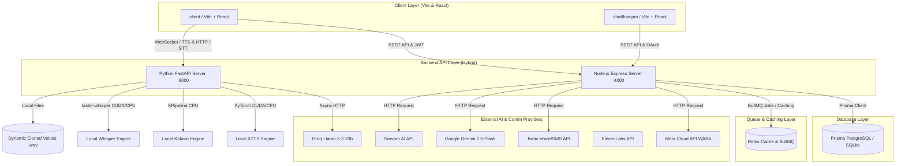
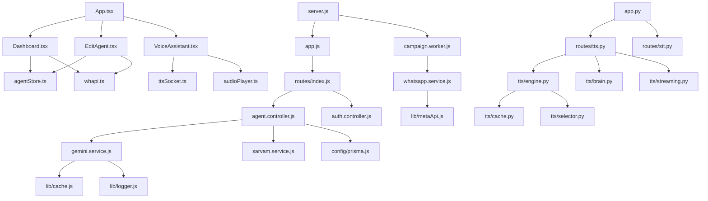
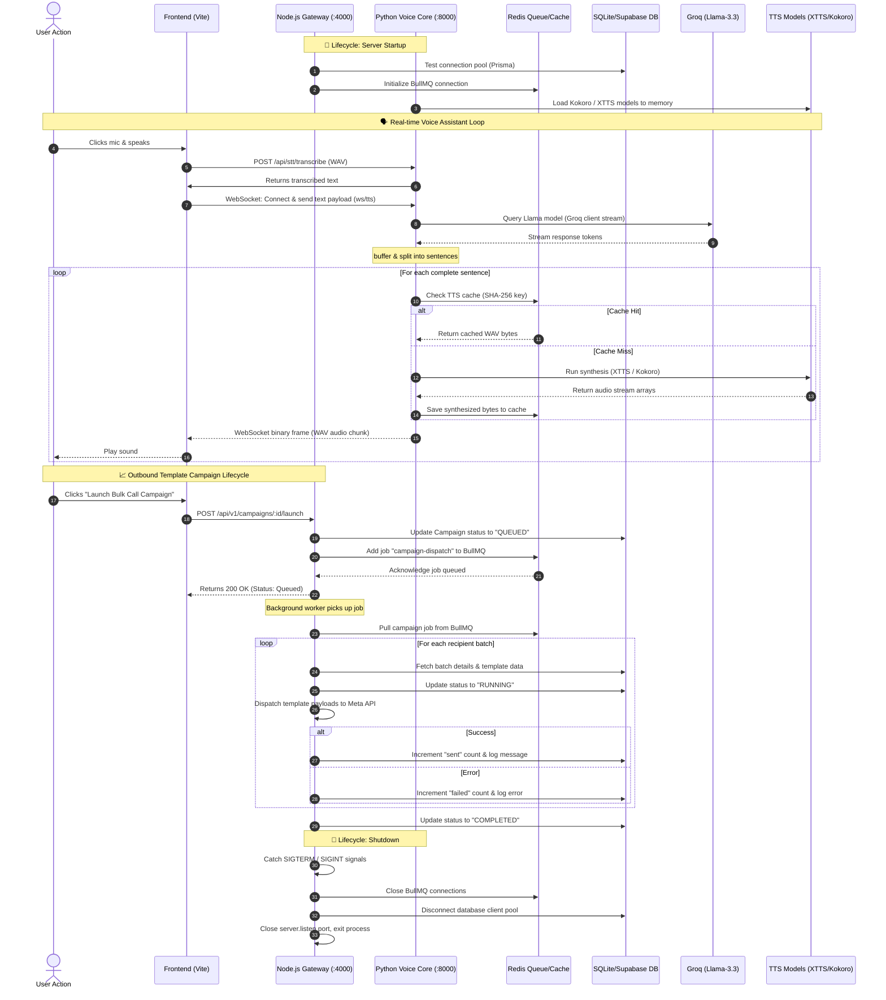

# Conversational AI Agent — Technical Analysis & Codebase Walkthrough

This document provides a comprehensive, production-grade architectural analysis and walkthrough of the **Conversational AI Agent** (also known as the **OmniDimension Platform**) codebase.

---

## 1. High-Level Architecture

The platform uses a hybrid, multi-service architecture designed for real-time, low-latency conversational AI and messaging campaigns. It decouples general business API operations, database access, and chat histories from compute-heavy speech transcription (STT) and voice synthesis (TTS).

### Communication & Data Flow Overview
1. **Frontend to Express Backend (Port 4000)**: Communicates via REST APIs with JWT authentication. Used for administrative tasks, agent configuration, templates, campaigns, live chat, and oauth flows.
2. **Frontend to Python FastAPI Backend (Port 8000)**: Communicates via WebSockets for real-time Text-to-Speech (TTS) streaming and HTTP POST multipart-form data for Speech-to-Text (STT) transcription.
3. **Database Scoping**: Scoped per Workspace. All business-related data queries use Prisma, reading from PostgreSQL in production and SQLite in development.
4. **Caching & Asynchronous Processing**: BullMQ operates on Redis to handle outbound messaging campaigns. Standard AI responses and TTS audio bytes are cached in Redis (or in-memory fallback) to minimize latency.
5. **AI Models & Comm Providers**: The Express API interfaces directly with Google Gemini, OpenAI, or Sarvam AI for chat and structured flow generation. The Python API orchestrates Groq Llama-3.3 for conversation generation, transcribes audio locally using Whisper, and synthesizes audio locally using XTTS v2 / Kokoro.

---

## 2. Request Flow

### 2.1 Outbound Chat Flow (Text Assistant)
When a user submits a message in the [ChatComponent.tsx](file:///client/src/components/ChatComponent.tsx):
1. **User Action**: User types text and hits "Send".
2. **Frontend State**: Appends user message to state, displays loading spinner, and issues a POST to `/api/v1/workspaces/:workspaceId/agents/:agentId/chat` (routed via `whapi.ts`).
3. **Express Middleware**: Authenticates JWT token, retrieves workspace, checks role scope (admin/member).
4. **Express Controller**: [agent.controller.js](file:///backend/src/controllers/agent.controller.js#L146) extracts history, prompts, and options.
5. **LLM Invocation**: Invokes Gemini API via [gemini.service.js](file:///backend/src/services/gemini.service.js).
   - If a cached response matches the message/history hash, it returns instantly.
   - Otherwise, the service connects to Google Generative AI, retrieves the response, caches it, and returns the message.
6. **Response Transmission**: Express backend returns the JSON response with the reply payload.
7. **Frontend Rendering**: Chat state updates; the assistant bubble displays the text.

### 2.2 Real-time Voice Chat Flow (Voice Assistant)
When a user interacts with the [VoiceAssistant.tsx](file:///client/src/components/VoiceAssistant.tsx):
1. **User Speaks**: User clicks the Mic icon. WebRTC records speech to audio chunks in a `MediaRecorder` instance.
2. **STT Transcribe**: On recording stop, audio is sent to Python FastAPI (`http://localhost:8000/api/stt/transcribe`).
3. **FastAPI STT**: [stt.py](file:///backend/routes/stt.py) stores the audio in a temporary file and feeds it to `WhisperModel`. Whisper transcribes the speech and returns the text payload.
4. **WebSocket Send**: The frontend sends the transcribed text to Python’s WebSocket server (`ws://localhost:8000/api/tts/ws/tts`) with `is_chat: true`.
5. **FastAPI Brain & TTS (Parallel Pipeline)**:
   - **Brain**: [brain.py](file:///backend/tts/brain.py) streams response tokens from Groq.
   - **Sentence Splitting**: Tokens are buffered and split on sentence boundaries (`.`, `!`, `?`).
   - **TTS Streaming**: The moment a sentence is complete, it is pushed to `TTSEngine` (XTTS / Kokoro). [engine.py](file:///backend/tts/engine.py#L267) starts yielding raw WAV audio chunks.
6. **Audio Streaming**: FastAPI sends raw binary WAV frames through the WebSocket to the browser.
7. **Barge-in / Playback**: [audioPlayer.ts](file:///client/src/services/audioPlayer.ts) schedules and plays the raw audio chunks. If the user starts speaking (triggering the mic), volume detection triggers a "Barge-in" which immediately stops AI audio playback.

---

## 3. Dependency Analysis

The following diagram traces core file dependencies across the project:

---

## 4. Folder-by-Folder Explanation

### 📂 Root Directory
* **`README.md`**: Provides a quick overview, setup instructions, and description of core features.
* **`STARTUP.bat` / `STARTUP.ps1`**: Automated startup files that check Node.js installation, install dependencies for both client and backend, configure `.env` templates, and provide a walkthrough of terminal commands for local execution.
* **`OLLAMA_SETUP.md` / `TROUBLESHOOTING.md`**: Infrastructure references detailing setup for local LLM models and addressing common development questions.

---

### 📂 `backend/`
Contains the Express API and FastAPI services.
* **`app.py`**: Entry point for FastAPI on port 8000. Configures CORS and hooks up the `/api/tts` and `/api/stt` routers.
* **`check_db.js`**: A diagnostic script that reads current users, workspaces, and members from SQLite to verify Prisma DB state.
* **`package.json`**: Lists Node dependencies (BullMQ, Prisma Client, JWT, Node-Fetch) and hooks up scripts like `npm run dev` and `npm run worker`.
* **`requirements.txt`**: Lists Python dependencies for voice AI (`faster-whisper`, `TTS`, `kokoro`, `fastapi`, `groq`, `soundfile`).
* **`start-backend.bat`**: Shortcut to boot the Express backend locally.

#### 📂 `backend/src/`
* **`server.js`**: Bootstraps the Node server on port 4000. Establishes the DB connection pool, initializes BullMQ workers, starts the integration synchronization schedule, and registers SIGTERM/SIGINT shutdown signals.
* **`app.js`**: Initializes the Express app, configures security headers (Helmet), manages origins, processes JSON and raw bodies, and connects routes.

#### 📂 `backend/src/config/`
* **`env.js`**: Schema validator for environment configurations. Standardizes defaults, parses numbers, and enforces constraints.
* **`prisma.js`**: Instantiates and exports a singleton instance of `PrismaClient`. Logs queries in development.
* **`redis.js`**: Connects to Redis via `ioredis` for BullMQ queues.

#### 📂 `backend/src/lib/`
* **`cache.js`**: Implementation of `CacheManager`. Features dual Redis and memory map caching with automatic entry eviction.
* **`encryption.js`**: Performs symmetric AES-256-CBC ciphering. Encrypts and decrypts Twilio/Meta OAuth access tokens for safe database storage.
* **`hash.js`**: Implements Bcrypt password hashing.
* **`logger.js`**: Configures a unified `pino` logger.
* **`rateLimiter.js`**: Implements token bucket limits.
* **`sse.js`**: Utility to manage Server-Sent Events (SSE) connections.

#### 📂 `backend/src/middleware/`
* **`authenticate.js`**: Decodes Bearer JWT tokens. Hashes and authorizes API keys starting with `sk_live_`/`sk_test_` against the database.
* **`workspaceContext.js`**: Extracts the `:workspaceId` route param, validates user workspace memberships, and configures bypass mocks for local development.
* **`errorHandler.js`**: Standardizes error handling across the application.

#### 📂 `backend/src/controllers/`
* **`agent.controller.js`**: Handles agent CRUD operations. Houses the `chat` method that passes history and prompts to the Gemini Service, and the `testCall` method that initiates Twilio Outbound calls.
* **`llm.controller.js`**: Exposes `/api/llm/generate-flow` which utilizes LLMs to generate system prompts and structured workflow configurations.
* **`auth.controller.js`**: Manages registration, login, and Google OAuth callbacks, using a mock auth bypass fallback if the database is disconnected.
* **`whatsapp.controller.js`**: Manages WABA numbers and template mappings.

#### 📂 `backend/src/services/`
* **`gemini.service.js`**: Wraps Google Generative AI. Normalizes chat histories, implements retries, handles caching, and tracks token usage.
* **`sarvam.service.js`**: Handles Indian language prompts (Hindi, Gujarati, Tamil, Telugu) and routes requests to Sarvam completions.
* **`llm.factory.js`**: Factory pattern that instantiates services (Gemini, OpenAI, Azure, Custom, Mock) based on configuration.
* **`whatsapp.service.js`**: Sends template payloads to Meta's message endpoints and synchronizes numbers from Twilio.
* **`voice.service.js`**: Manages voice library queries.
  > [!WARNING]
  > **Database Schema Mismatch:**
  > The functions in `voice.service.js` reference `prisma.voice` and `prisma.agentVoice` models. However, these models do not exist in the current `prisma/schema.prisma` file. Calling these endpoints will result in runtime errors due to missing database tables.

#### 📂 `backend/src/workers/`
* **`campaign.worker.js`**: Spawns BullMQ workers that pull pending campaign recipients, verify opt-out flags, dispatch templates via Meta API, and log statistics.

#### 📂 `backend/routes/` (Python Backend)
* **`tts.py`**: Defines HTTP endpoints and WebSockets for voice preview, dynamically uploads .wav custom voice clones, and streams speech tokens via WebSocket.
* **`stt.py`**: Fast-Whisper transcription wrapper.

#### 📂 `backend/tts/`
* **`engine.py`**: Main speech synthesis controller. Implements local XTTS/Kokoro loaders, scans cloned voice templates, and chunks binary output arrays.
* **`brain.py`**: Manages Groq Async client pipelines, queries Llama models, and splits output into complete sentences.
* **`cache.py`**: Thread-safe LRU cache using a `threading.Lock` wrapper around `OrderedDict`. Generates SHA-256 keys to avoid collision.

---

### 📂 `client/`
Frontend dashboard app.
* **`package.json`**: Orchestrates frontend packages (Tailwind, Lucide React, Shadcn elements, React Router).
* **`start-frontend.bat`**: Shortcut script to run the frontend server on port 5173.

#### 📂 `client/src/`
* **`App.tsx`**: React routing layout, featuring Public paths (Home, pricing, book-appointment) and Protected paths (dashboard, bulk call, call logs, integrations) wrapped in a `ProtectedRoute` component.
* **`styles.css`**: Incorporates custom styles and overrides.

#### 📂 `client/src/lib/`
* **`agentStore.ts`**: Simulates DB interactions in the browser. Reads and writes agent config objects directly to `localStorage` (key: `voice_ai_agents_v1`) as a dev fallback.
* **`whapi.ts`**: Wrapper for `fetch`. Automatically injects the JWT token from storage and scopes requests to `/api/v1/workspaces/${workspaceId}`.
* **`storage.ts`**: Safely retrieves and sets items in local/session storage.

#### 📂 `client/src/components/`
* **`VoiceAssistant.tsx`**: Core voice assistant interface. Hooks up user speech recorders, calls transcription APIs, connects WebSocket streams, and triggers barge-in interrupts.
* **`ChatComponent.tsx`**: Conversational chat interface. Submits messages to backend chat services and appends responses.
* **`Navbar.tsx` / `NavLink.tsx`**: Header and sidebar navigation controllers.

#### 📂 `client/src/pages/`
* **`Dashboard.tsx`**: Aggregates statistics, displays active call graphs, and enables agent creation.
* **`EditAgent.tsx`**: Complete agent configurator. Lets users define prompts, LLMs, and voice parameters, and configure custom dialog nodes.
* **`AdminPanel.tsx`**: Admin portal to monitor users, manage workspaces, and check service status.

---

### 📂 `chatflow-pro/`
An alternative Vite/TypeScript interface dedicated to building advanced, node-based conversational templates and workflows.

---

## 5. Technology Stack

| Technology / Library | Purpose | Rationale |
| :--- | :--- | :--- |
| **React / Vite** | Client interface framework | Provides fast hot module reloading (HMR) and bundle compilation. |
| **Node.js / Express** | Main API Gateway & Service Orchestration | Lightweight and highly extensible for managing workspaces, webhooks, and auth flows. |
| **FastAPI** | Voice Services Host (Python) | High-performance async processing; ideal for loading PyTorch ML models. |
| **Prisma ORM** | Schema & Database management | Offers type-safe database queries and automated schema migrations. |
| **PostgreSQL** | Primary Database | Secure relational database (hosted on Supabase) to manage users, memberships, and logs. |
| **SQLite (dev.db)** | Development Database | Zero-dependency database for running the platform locally. |
| **Redis** | In-memory message broker & cache | Backs BullMQ queues and caches API responses. |
| **Groq (Llama-3.3)** | Conversational voice engine | Ultra-fast token generation, keeping TTS first-chunk latency under 200ms. |
| **Google Gemini 2.5** | Multi-turn chat & schema builder | High accuracy for parsing prompts and generating structured config JSONs. |
| **faster-whisper** | Local Audio Transcriber (STT) | Re-implemented Whisper model utilizing CTranslate2, yielding up to 4x faster execution than vanilla OpenAI Whisper. |
| **XTTS v2** | Dynamic Voice Cloner | Coqui model capable of cloning any voice from a short 3-second wav snippet. |
| **Kokoro-82M** | Low-latency fallback TTS | Lightweight model that generates high-quality speech with minimal hardware requirements. |
| **BullMQ** | Distributed Job processing | Manages large-scale campaign dispatching and message scheduling. |
| **Bcryptjs** | Password Hashing | Secures user passwords before database storage. |
| **AES-256-CBC (crypto)** | Symmetric encryption | Protects third-party integration tokens (Meta/Twilio) in database columns. |

---

## 6. Learning Guide (Core Concepts Explained)

### 6.1 WebSockets (Real-time Full Duplex)
* **What it is**: A persistent, bidirectional protocol that runs over a single TCP connection.
* **Why it's used**: Standard HTTP requests require a new handshake for every call. WebSockets keep a connection open, allowing the client to send audio data and receive generated speech chunks instantly.
* **Beginner-friendly explanation**: Imagine HTTP as sending letters back and forth. You write, send it, wait, and get a reply. WebSockets is like a phone call; once connected, you can both talk and listen continuously without hanging up.
* **Interview explanation**: WebSockets upgrade an initial HTTP connection using an `Upgrade` header. They operate over TCP port 80 or 443, enabling full-duplex communication with minimal frame overhead (2-10 bytes) compared to HTTP headers, which is crucial for real-time applications.

### 6.2 JWT (JSON Web Tokens) & Refresh Tokens
* **What it is**: An open standard (RFC 7519) that safely transmits information between parties as a JSON object.
* **Why it's used**: JWTs allow the backend to verify user identity without querying the database on every request. Refresh tokens are stored in the database to safely issue new access tokens when they expire.
* **Beginner-friendly explanation**: An access token is like a movie ticket. The gatekeeper checks it and lets you in without calling the manager. A refresh token is like a membership card; if your ticket expires, you present the card to get a new ticket.
* **Interview explanation**: Access tokens are stateless, short-lived (e.g., 15 minutes) cryptographically signed tokens (usually HMAC SHA-256). Refresh tokens are long-lived, stored in the database, and checked against revocation lists to generate new access tokens. This prevents full credential re-validation while maintaining security.

### 6.3 BullMQ & Redis Queues
* **What it is**: A NodeJS message queue system backed by Redis.
* **Why it's used**: Sending bulk WhatsApp templates to 10,000 users takes time. If the backend fails mid-send, the campaign halts. BullMQ queues these tasks, processing them in the background with retry logic.
* **Beginner-friendly explanation**: Imagine a busy coffee shop. Instead of the barista taking your order, making the coffee, and serving you while everyone else waits, a cashier takes orders and puts tickets on a line. Baristas pull tickets one by one to make the coffee.
* **Interview explanation**: BullMQ uses Redis data structures (specifically sorted sets and hashes) to guarantee atomic execution of job operations via Lua scripts. This offloads resource-heavy operations from the event loop and ensures workers process tasks reliably.

### 6.4 LRU (Least Recently Used) Caching
* **What it is**: A caching algorithm that discards the least recently used items first when the cache reaches its limit.
* **Why it's used**: Running TTS on the same welcome message over and over is computationally expensive. Caching the WAV bytes saves CPU cycles.
* **Beginner-friendly explanation**: Imagine a desk with limited space. You keep the folders you use most close to you. When you need to make room for a new folder, you throw away the one you haven't opened in the longest time.
* **Interview explanation**: An LRU cache maps keys to values in constant time $O(1)$. It combines a hash map for fast lookup with a doubly linked list to track access order. When memory limits are reached, the tail of the list is evicted.

---

## 7. Execution Lifecycle

### 7.1 Startup Lifecycle
1. **Express Server Initialisation**:
   - Executes `server.js`.
   - Creates the uploads folder (`uploads/`) if it doesn't exist.
   - Tests DB connectivity via `prisma.$queryRaw` (falls back to mock auth on failure).
   - Establishes Redis connections for BullMQ workers.
   - Starts the integration sync scheduler to poll external APIs (N8N, Slack).
   - Starts listening on port 4000.
2. **FastAPI Voice Core Initialisation**:
   - Executes `app.py`.
   - Checks CUDA capability. Loads the primary model (**XTTS v2**) and fallback model (**Kokoro**) into memory.
   - Scans the `voices/` directory, checks the metadata json, and populates the available voices cache.
   - Starts the Uvicorn listener on port 8000.

### 7.2 Shutdown Lifecycle
1. **Signal Interception**: Node catches `SIGTERM` / `SIGINT` signals.
2. **Resource Cleanup**:
   - Express stops accepting new requests.
   - Active campaign workers finish their current batches.
   - Redis connections are closed.
   - Prisma client disconnects from the database.
   - Node process exits with code 0.
